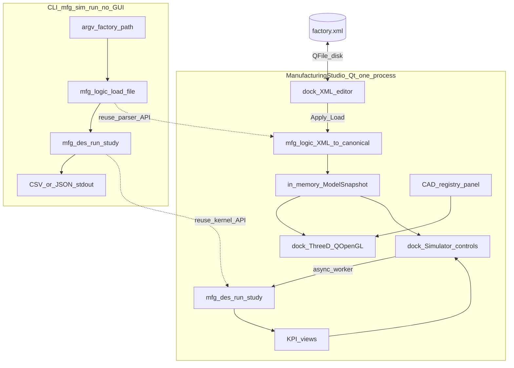

# Manufacturing simulator — Python-first (DES + DXF + simple 3D + XML)

## Architectural separation versus **one program (studio)**

**Deliverable UX:** Ship as **one** macOS/desktop app (**working name:** `ManufacturingStudio`) with **dockable/tabbed panels**:

| Panel | Role |
|---------|------|
| **XML** | **`QPlainTextEdit`** (+ line numbers/highlights optional): edit document; **Save/Apply** parses via **`mfg_logic`** → push updates to others. |
| **3D view** | OpenGL **`QOpenGLWidget`**: CAD-like navigation + hover labels + DXF registry wiring; consumes **canonical visual + read-only logical** slices for tooling. |
| **Simulator** | Controls + readouts (**Run Study**, **`perfect`/`likely`/`worst`**, **`Replications`** summary/export); invokes **`run_study(...)` from `mfg_des` in-process** (worker thread/async so UI stays responsive). |

Menus: **Open/Save**, **reload from disk**, **validate model**, optionally **detach** panels (Qt docks support floating windows).

**Why this is still “three separate entities” technically:** **`mfg_des`** remains a plain Python library (**no upstream import** of **`mfg_visualize`** or Qt); the **viewport module** (**no upstream import** of **`mfg_des`**); **`mfg_logic`** has no GL. Only the **thin `mfg_studio` application layer** wires them together—so each piece stays **testable in isolation**. Optional **`python -m mfg_sim_run`** entry remains for CI / scripting **without launching the IDE**.

---

## Hard separation at the **package** boundary

| Principle | Requirement |
|-----------|--------------|
| **Simulation kernel never imports graphics** | **`mfg_des`** uses only **logical** model + **`Simulation`** study params (stdlib/math/NumPy). **No** Qt, PyOpenGL, mesh loaders. **`mfg_sim_run`** prints **scenario/distribution** results with **no main window**. |
| **Viewport never imports simulator** | OpenGL/Qt code lives in a **`mfg_visualize`**/**`mfg_viewport`** package that **never `import`s `mfg_des`**; preview + validation work from **canonical model snapshot** alone. Users can stare at topology **without pressing Run**. |
| **Shared single source** | **`mfg_logic`**: XML → validated dataclasses; splits **`logical_model`** vs **`visual_model`**; **`mfg_des`** reads **logical (+Study)** only; viz reads **visual + logical subsets** only. **Studio orchestrator** holds one parse result after **Apply** / file load. |

**Later:** live-run overlays ingest **replay files** produced by **`mfg_des`** without reverse callbacks into scheduler internals.

---

## Product goals (MVP)

- Load a factory model from **XML** (stable, versioned schema).
- **Machines**: render **DXF-derived** geometry **only when** Layout references an asset **id** that exists in the app’s **DXF registry** (uploaded DXF bound to stable id + display name). Otherwise **fallback placeholder**—e.g. **large oriented box/slab** sized from **`Layout`/stage** defaults (**`extentX`**/**`extentY`**/**`extentZ`** or similar).
- **Conveyors, humans, buffers, queues, and all non-machine visuals**: **generic entities only**—no DXF pipelines (segments, elongated prisms, simple humanoid proxies, tinted boxes); sim logic unchanged.
- **Studio layout:** editable **XML** buffer + validation strip; separate **Simulator** pane for KPIs—not a vague “inspector only” appendix.
- **Same study from Simulator panel _or_ `mfg_sim_run` CLI** (no mandatory window only for scripted use): **horizon**, **factory output total**, **`perfect`/`likely`/`worst`**, optional **replication distribution** as already specified; **`mfg_des`** stays windowless under the hood.
- Toggle focus between **XML edit**, **3D check**, **Run study** in one window (**plus** DXF registry as needed)—no separate install expectation for MVP.
- Iterate: edit XML (**Apply**), **Simulator** / **CLI** rerun; CAD registry tweaks **3D dock only**.

## Stack choice — mostly Python

| Layer | Choice | Rationale |
|--------|--------|-----------|
| Desktop UI | **PySide6** (or PyQt6) | Native macOS feel, mature file dialogs, split views (3D + text inspector). |
| 3D (simple, custom-friendly) | **PyOpenGL** (+ helpers like **PyGLM** for matrices) | Thin render loop under Qt; you own geometry from primitives + DXF tesselation. **ModernGL or VisPy** remain optional substitutes if you refactor later. |
| DXF | **ezdxf** | Solid Python ecosystem for parsing DXF; convert entities → line strips / tessellated faces for GPU buffers. |
| **Simulation engine** | **Thin MVP** behind a **`SimEngine`** protocol + **minimal concrete implementation**; later swap in full DES (**heapq** / **SimPy**) without changing CLI contract | MVP focuses on **horizon + output counting + replication stats**; **NumPy** helps summarize **N runs** (percentiles, bins). |
| Compiled speed-ups (optional later) | **NumPy**, **Numba** (`@njit`), or thin **C extension** | Use when a profile shows a real hotspot (e.g., batch RNG for presampling, Monte Carlo envelopes, dense metric histograms)—not assumed day one. |

**Honest constraint:** Until the engine grows a real DES hot loop, **runtime is whatever the stub costs**; once event volume grows, NumPy helps **post-run arrays** and batch RNG more than the scheduler itself. Keep **one interface** so you can harden innards later.

### Why drop Godot/Rust here

They optimize for AAA 3D and multi-language bindings you want to avoid. Your preferences (Python familiarity, modest graphics, DXF-heavy custom pipeline) fit a **Qt + thin OpenGL renderer** stack better.

## System diagram



**Reading:** **`ManufacturingStudio`** composes docks; **`mfg_sim_run`** repeats **`mfg_logic` → `mfg_des`** with **no** Qt/OpenGL imports.

**DXF registry resolution:** **`Layout`/Placement** cites **`machineMeshRef`** (= registry **`id`**). Resolver = registry hit → tessellated mesh; **miss / empty** → **placeholder** slab with transform + optional **`extent*`** overrides.

Optional later path (dashed intentionally **not inside** cores): **`RunnerC`/`RunnerUI` → SnapshotFile[state_JSONL]** → **3D viewport** cosmetics-only playback.

---

## Canonical model split

- **Logical** (DES): **factory → production lines → stages** connected by **transfer links**. Each processing stage (**machine-like**) hosts one **operation** (duration, BOM inputs, outputs including scrap); **buffers / queues / other physical stages** absorb WIP/constraints without necessarily transforming goods. Separate **workers** (pools + assignments), **failure/stoppage behaviors**, optional **supervisory rules** (e.g., starve/starve-off upstream when downstream is slow).
- **Visual / layout**: binds **logical `stage`/machine ids** to **transform**, optional **`machineMeshRef`** (**DXF registry id only**—machines **only**), optional **placeholder extents** when no CAD; conveyor/human/agent visuals come from **`generic`** records (primitive type + params)—not DXF.

- **DXF ingestion**: **machines exclusively** (`ezdxf` → normalized lines/mesh per **registry asset id**). **Floor plan** CAD is optional later and **not** part of MVP DXF scope unless explicitly added (**no DXF conveyors/agents**).

DWG stays **import via DXF** (external convert) or defer.

## XML factory model (`schemaVersion=1`)

Top-level grammar (order below is suggested for readability for humans; loader may accept any element order):

1. **`Factory`** — attrs: `schemaVersion`, optional **`timeUnit`** (e.g., `minute`/`second`); contains **declaration** blocks then **`Simulation`** (**MVP run contract**—see below), **`Lines`**, **`Transfers`**, **`Workers`**, **`Controls`**, **`Layout`**, **`Extensions`** (other blocks unchanged).

Stable **`id`** (unique string) everywhere the sim refers to an entity. Human-readable **`name`** where useful (machines/stages/lines/products).

---

### `Simulation` block (MVP run contract—not full DES spec)

Binds **what the headless CLI must produce** independent of eventual engine internals:

| Element / attr | Meaning |
|------------------|---------|
| **`Horizon`** | Single simulated **clock stop** (**`duration`** + same **`timeUnit`** as factory—or absolute attribute). CLI errors if horizon missing unless overridden by flag. |
| **`OutputDefinition`** | **What counts as one unit of “factory output”** for MVP—e.g., **`sinkStageRef`** (finished-goods buffer / shipping stage id) and optional **`productRef`** filter, or **`countEvents="good_units_exit"`** enum later. One clear rule v1 avoids ambiguity across lines. |
| **`Scenarios`** | Named profiles the engine applies when asked (may be **no-ops** until engine understands failures): e.g. **`perfect`** (disable stochastic failures / use nominal times), **`likely`** (default stochastic draw), **`worst`** (pessimistic profile—**not guaranteed global bound** unless you define it formally later). Keep **opaque** **`Extensions`** inside each scenario for forward parameters. |
| **`Replications`** | Attr **`n`** (Monte Carlo). When `n>1`, summarize **`likely`** draws (seed stream per rep). Emit **distribution**: at least **`min`**/**`max`**/**`mean`** + **`p05`/`p50`/`p95`** optional, or **`histogramBuckets`**. **`seed`** base optional for repeatability. |

**CLI behaviour (MVP):** default print **three numbers** (+ metadata): `perfect_output`, `likely_output` (single stochastic run **or** **`p50`** when `Replications n>1`), and `worst_output`; optional **`--distribution`** dumps fuller JSON (`min`/`max`/percentiles/histogram). **`perfect`/`worst`** are **declarative scenario knobs**—treat as **engineering shorthand**, not proofs of global best/worst, until the engine matures.

Illustrative fragment:

```xml
<Simulation>
  <Horizon duration="480" unit="minute"/>
  <OutputDefinition sinkStageRef="SHIP" productRef="FINISHED_WIDGET" quality="good"/>
  <Scenarios>
    <Scenario id="perfect" policy="no_failures_nominal_time"/>
    <Scenario id="likely" policy="default_stochastic"/>
    <Scenario id="worst" policy="max_downtime_failures"/>
  </Scenarios>
  <Replications n="1000" seed="42"/>
</Simulation>
```

(`policy` strings are **engine hints**—MVP engine implements a **minimal subset**; unknown policies → **warning + skip** or map to `likely`.)

---

### Hierarchy and identity

```
Factory
  Simulation                  # MVP: horizon, countable output definition, scenarios, replications (see section above)
  Assets?                     # OPTIONAL logical aliases only—not file paths; CAD files registered in-app (see DXF Asset Registry UI)
  Products?                   # SKU / BOM catalog for materials (recommended)
  Lines
    Line[@id,@name,...]
      Stages
        Stage[@id,@kind,...] ...
  Transfers
    Transfer[@id] ...       # connects one directed edge between stages within or across lines
  Workers ...
  Controls ...              # optional supervisory / starvation / downtime policies
  Arrivals?                 # how orders/parts/wip enters the factory
  Metrics?                  # knobs for KPI collection (future)
  Layout ...
  Extensions ...
```

---

### Lines and stages (`Stage[@kind]`)

Each **`Line`** is an ordered subgraph in practice but **topology is graph-shaped**: stages are vertices; **Transfers** declare directed edges along which **material tokens** move (later you can forbid cycles by validation).

| `kind` (MVP enums) | Role in sim |
|--------------------|--------------|
| `machine` | Server with **capacity** + **processing time** distribution + **inputs/outputs recipe** (+ failures, scrap). Typically capacity 1 for “single machine”; >1 optional for parallel bays. |
| `buffer` | Finite or infinite accumulation; FIFO by default—no transform. |
| `queue` | Same family as buffer; use different defaults (e.g., strict capacity, prioritization)—keep distinct in XML for semantics/docs. |
| `physical` | Catch-all anchor for layout-only or passive constraints (gates, docks, pallets, merge points) that may later acquire behavior without inventing new top-level concepts. Extend with **`behavior`** subtype if needed. |

**Recommendation:** Exactly **one** “operation” resides on **`machine`** (and optionally on specialized physical nodes later via `behavior="transform"`). Buffers and queues **do not** run operations in v1—they only hold/move tokens per link rules—so BOM merge/split lives on machines or dedicated **assembly**/**disassembly** stages (still `kind="machine"` with semantics flag).

Stage common attributes:

- **`id`** (required), **`name`** (optional display).
- **`kind`** as above.
- **`capacity`** (buffers/queues/machines server queue where relevant).
- Optional **`workersRef`**/`workerRole`: labor required during process (see Workers).
- Optional **`Failures`**, **`Downtimes`**, **`ControlsRef`** scoped to stage.

---

### Transfers (“conveyors” and humans)

**`Transfers`** hold **edges** **`Transfer`**:

- **`from`** / **`to`**: **`stage`** IDs (validators ensure both exist; cross-line edges allowed unless you disallow with a flag).

**Mode attributes**—describe *movement*, not transforming:

| Attribute | Meaning |
|-----------|----------|
| `mode="conveyor"` | Delay + batch policy (belt): constant or sampled **transitServiceTime** distribution. |
| `mode="manual"` / `human` | Same abstraction: different timing distribution (walker, forklift), optionally **requiresWorker** linkage. |

Optional **`capacity`** (max in-flight pallets on belt), **`priority`** (tie-break).

**Interpretation:** A transfer is either a **`DelayResource`** (fixed delay pipe) or a tiny server with capacity in the DES—implementer chooses; XML stays “edge with delay + mover type”.

---

### Operations (`Operation` inside `machine` stage)

**Input model (multi-source BOM):** Repeated **`Input`** elements:

- **`productRef`** — references **`Products/Product/@id`** (SKU / material grade / subassembly).
- **`quantity`** per job or per cycle (define whether operation consumes **lots** vs **individual** units in sim—default unit is “single discrete unit”; batch via `quantity` + “lot” semantics in extensions).
- **`from`** optionally constrains sourcing: **`stage`** id subset (consume only from inbound buffer fed by listed predecessors) vs “any reachable inventory” (**default**: consume from implicit **input buffer** of this machine—that buffer is stocked by inbound **Transfers**, so physical inputs from multiple lines resolve naturally).

**Output model:** Repeated **`Output`**:

- **`productRef`**, **`quantity`**.
- **`quality`**: `"good"` | `"scrap"` | `"byproduct"` — drives accounting and disposition (scrap path can route via dedicated transfer to waste stage).

**Service time:**

- **`ServiceTime`** child: **`distribution`** (`fixed`, `normal`, `lognormal`, `triangular`, `empirical`), parameters as attrs or **`Param`** rows.

---

### Rare failures & jamming

Inside **`Failures`**:

- **`Failure type="jam" probability="1e-4"`** (or **`probabilityRational="1/10000"`** if you prefer exact rationals)—evaluated once per completion attempt or machine cycle per your semantics.

Child nodes define **resolution**: **`repairTime`** distribution, **`scrapRate`** on jam, **`clearUpstream`** booleans—version v1 keeps this minimal (**sample time + reschedule**).

**Policy:** Decide whether probability is **per job start**, **per time unit**, or **per processed unit**—encode with **`timing="on_cycle_start"|"during_process"|"on_completion"`** so “1 in 10000 widgets” stays unambiguous later.

---

### Workers

**`Workers`** (top-level block):

- **`Pool`** elements: **`id`**, **`size`**, optional `skills` / **`role`**.

**Stage-level:** **`workersRequired`**:**

- **`poolRef`** + **`count`** OR **`during="setup|process|whole_cycle"`**.
- Blocking rule: insufficient workers → stage **blocked** / **paused** depending on **`Control`** settings.

Humans affecting **Transfers** reuse **`requiresWorker`** on `Transfer`.

---

### Supervisory behaviors (starvation / slowdown ahead)

Separate **declarative** **`Controls`** (small rule language; extensible via **`Extensions`**):

Example rule concept (XML sketch only—not final syntax):

```xml
<Control id="c_starve_upstream" scope="factory">
  <Policy type="upstream_starve_when_constrained">
    <Watch stageRef="Mach_Downstream" metric="blocked_time_rate" threshold="..." windowMinutes="..." />
    <Act onStage="Mach_Upstream_1" action="pause_processing" duration="until_clear" />
  </Policy>
</Control>
```

MVP implementations can recognize only **two or three metric types** (`queue_length_above`, `downstream_blocked`, `output_rate_below`)—unknown elements land in **`Extensions`** for forward compatibility.

Stages may **`controlsRef`** to pull in reusable policies instead of repeating conditions.

---

### Products catalog

**`Products`** lists discrete SKUs (**`Product id`** + optional mass, rework flags). Operations reference **`productRef`** for inputs/outputs. This keeps many-to-many BOM relations explicit without tying material identity to geography.

---

### Arrivals

**Orders** or **`PartSource`** stages (special `physical`/`queue` emitting arrivals) **`interarrival`** / schedules so every line can fed.

---

### Layout (visual bindings)

- **`Placement`**: **`stageRef`** (machine **or** other stage for generic draw); **`translate`/`rotate`/`scale`** (or homogeneous matrix).
- **Machine visuals only:** **`machineMeshRef`** attributes **equal to** a **`id`** in the **running app’s DXF registry** (**not** embedded file paths in XML v1—you can extend with optional `hintPath` later). **`displayName`** in registry is UI-only (tooltips, registry table); **`name`** on stage stays the sim/display name.

- **No mesh / registry miss:** render **`FallbackGeometry type="slab"`** defaults—e.g. **`extentX`**, **`extentY`**, **`extentZ`** centered on **`translate`** (**“large rectangle”** = wide flat box or billboard-friendly slab you standardize).

- **Generic entities (mandatory primitive path)**—conveyors, humans, carts, unnamed buffers visually:

```xml
<GenericVisual id="gv_T1_display" primitive="conveyor">
  <Endpoints fromStageRef="Q_in" toStageRef="M_assy"/><Param key="width" value="1.2"/>
</GenericVisual>
<GenericVisual id="gv_human_1" primitive="human" poolRef="OP"/>
```

**(Illustrative—final element names aligned with `Transfer`/`Stage` refs.)** Conveyors can **auto-route** endpoints from **`Transfer`** if you omit duplicates; humans may **spawn** from worker visualization rules. **Never `machineMeshRef` / DXF here.**

### DXF Asset Registry UI (workspace, not buried in XML)

Dedicated **dock / panel**:

| Action | Purpose |
|---------|---------|
| **Add asset** | File picker (**`.dxf`**), assign **`id`** (stable, citation target from XML **`machineMeshRef`**) + **`displayName`**. Store **absolute or project-relative path** internally (persist in **session/proj file** optionally). |
| **List / Remove** | See bound paths; remove invalid id → next render warns and uses **placeholder** for those **`machineMeshRef`**. |

**Workflow:** Upload CAD once per project → XML only references **`id`** strings → sharing models **without copying DXF into XML** stays clean (**optional**: future `embedded path` fallback in **`Extensions`**).

---

### Extensibility (**`Extensions`**)

Any unknown future concern:

- Repeated **`KV key=value`** pairs, **`JSON`** blob **`CDATA`**, or vendor namespaces—loader **stores** verbatim for round-trip and optional plugins **without** bumping **`schemaVersion`** when possible.

Bump **`schemaVersion`** when you redefine core semantics required for backward compatibility.

---

### Validation rules (implement first)

- Every **`Transfer`** resolves to known stages; no dangling refs.
- **Acyclic physical flow** optionally configurable (warn vs error).
- BOM: every **`Input`** has resolvable **`productRef`**; outputs sum does not silently drop mass for accounting (warnings).
- Probabilities ∈ [0,1] unless using rational grammar.
- **Worker** totals never negative; capacity positive integers.

---

### Annotated illustrative fragment

```xml
<Factory schemaVersion="1">
  <Simulation>
    <Horizon duration="480" unit="minute"/>
    <OutputDefinition sinkStageRef="SHIP" productRef="FINISHED_WIDGET" quality="good"/>
    <Scenarios>
      <Scenario id="perfect" policy="no_failures_nominal_time"/>
      <Scenario id="likely" policy="default_stochastic"/>
      <Scenario id="worst" policy="max_downtime_failures"/>
    </Scenarios>
    <Replications n="500" seed="7"/>
  </Simulation>
  <Products>
    <Product id="PRT_A"/><Product id="SCRAP_DEN"/><Product id="FINISHED_WIDGET"/>
  </Products>
  <Lines>
    <Line id="L1" name="Line 1">
      <Stages>
        <Stage id="Q_in" kind="queue" capacity="500"/>
        <Stage id="M_assy" kind="machine" name="Assembler">
          <WorkersRequired poolRef="OP" count="1" during="process"/>
          <Operation>
            <Input productRef="PRT_A" quantity="2"/>
            <ServiceTime distribution="lognormal" mean="12" sd="3"/>
            <Output productRef="FINISHED_WIDGET" quantity="1" quality="good"/>
            <Output productRef="SCRAP_DEN" quantity="0.02" quality="scrap"/>
          </Operation>
          <Failures>
            <Failure type="jam" timing="on_cycle_start" probability="0.0001">
              <RepairTime distribution="fixed" seconds="900"/>
            </Failure>
          </Failures>
        </Stage>
        <Stage id="SHIP" kind="buffer" name="Shipping dock"/>
      </Stages>
    </Line>
  </Lines>
  <Transfers>
    <Transfer id="T1" from="Q_in" to="M_assy" mode="conveyor">
      <TransitService distribution="fixed" seconds="30"/>
    </Transfer>
    <Transfer id="T2" from="M_assy" to="SHIP" mode="conveyor"/>
  </Transfers>
  <Workers><Pool id="OP" size="4"/></Workers>
  <Controls><!-- supervisory rules referencing stage ids --></Controls>
  <Layout>
    <Placement stageRef="M_assy" machineMeshRef="CAD_ASSY_PRESS_01" extentX="4" extentY="2" extentZ="2.5"/>
    <GenericVisual primitive="conveyor" transferRef="T1"/>
  </Layout>
  <Extensions/>
</Factory>
```

(Prefer structured child elements like **`WorkersRequired`** and **`TransitService`** over cramming structs into attributes so validation stays XSD-friendly.)

---

### Simulation mapping notes

- **Join of multiple BOM lines** modeled by **multiple `Input` lines** referencing products that upstream stages feed via distinct transfers into the machine’s inbound buffer—or explicit **`fromStages`** narrowing.
- **Scrap**: separate SKU or **`quality`** flag + routing transfer to rework/waste **`Stage`** (buffer or sink).

## Simulation core (Python) — **MVP contract first, mechanics later**

**Principle:** **`mfg_des`** exposes a **narrow, stable surface** (e.g., `run_study(model, study_config) -> StudyResult`) so the **XML `Simulation` block** and CLI stay fixed while the **internal movement of events** can grow from a **toy forward pass** into a **full DES** without rewriting the app.

### MVP (this phase)

- **Input:** validated **`logical_model`** + parsed **`Simulation`** (horizon, output definition, scenario ids, replication count).
- **Output:** **Total count** (or float if partial lots—pick one in v1) of **good finished** units per **`OutputDefinition`** over **`Horizon`**.
- **Reporting:**
  - **`perfect`**: run under **no-failure / nominal-time** profile (exact meaning documented per engine version).
  - **`likely`**: **one stochastic run** at default policy, **or** **`p50`** (median) across **`Replications`** when `n>1`.
  - **`worst`**: **pessimistic profile** (e.g., failure whenever possible, long repair—**illustrative**, not a formal lower bound unless you later prove it).
  - **Optional distribution:** when `n>1`, emit **histogram / percentiles** via **NumPy** on the replication array.
- **Separation preserved:** still **no Qt/OpenGL** imports; **3D never calls** into **`mfg_des`** for static inspection.

### Future expansion (explicitly out of MVP scope)

- Full **event-level DES** (WIP, per-machine util, lead times, trace logs), richer **controls**, physics-adjacent **material tracking**, calibrated **scenario** definitions (e.g. certifiable bounds), parallel replication workers—all **plug in** behind the same **`SimEngine`** façade and evolve the **`Simulation`/XML schema** with **`schemaVersion`** bumps only when contracts change.

Seedable RNG streams remain a **recommended** implementation detail so **`likely`** / distributions **replay** across debugging sessions.

### Headless artefacts

- **Primary:** concise **JSON or CSV summary** rows for the three scenarios + optional distribution block.
- **Later:** replay / snapshot files for the viz—unchanged intent.

### Visual validation panel (**3D dock** or sibling tab — **never calls `run_study`**)

Automated checks (examples—not exhaustive):

- Every **`stage id`** appearing in **`Layout`** or **`GenericVisual`** resolves in **`Lines`** or **`Transfers`**.
- Every **`Transfer from/to`** exists; optional warning if **logical** stages lack **Placement** (**layout incomplete** versus **silent** intentional abstract model).
- **`machineMeshRef`** present in persisted registry or warn + placeholder.
- **Quick graph preview**: count lines, stages per line, ingress/egrees per stage for sanity.

## 3D rendering plan (minimal)

### Camera interaction (CAD-style target)

Assume **orbit target + eye** formulation (trackball-ish); concrete bindings per user preference:

| Input | Behaviour |
|---------|------------|
| **Primary click drag (LMB)** | **Pan** the view/target in the camera plane (**screen-space XY**), similar to grabbing the floor plane. |
| **Scroll wheel** | **Zoom toward cursor** hit on ground plane—or scale distance to target if no hit. |
| **Shift + primary click drag** | **Orbit / tilt / turn** the camera around the current target (azimuth + elevation), matching “CAD inspection” feel. |

**Implementation note:** keep sensitivity + invert toggles in **settings**; document macOS **trackpad** pinch as optional alias for zoom later.

### Hover tooltips (machines-first)

On **mousemove** throttle + **GPU picking** (**ray vs AABB** or coarse mesh BVHs first):

- Tooltip near cursor (small **QLabel**/frameless **`QWidget`** overlay or **immediate-mode Qt** tool tip)—**non-blocking**.
- Typical fields: **`id`**, **`name`**, **`kind`**, **`line`/`lineId`**, **`capacity`**, **`machineMeshRef`/registry resolved?**, abbreviated **operation**: dominant **`ServiceTime`** tag, **`WorkersRequired`** pool counts, **`Failure`** presence + rate shorthand.
- Buffers/generics may use **lighter** overlays later; MVP priority = **machines**.

### Drawing order/content

1. Perspective camera + **simple procedural floor/grid** (**no CAD floor requirement** unless you expand scope later).
2. **Machines:** **`machineMeshRef`** → DXF tessellation from **registry**, else **placeholder slab/box** (large default footprint configurable per placement).
3. **Buffers / queues:** generic **semi-transparent bins** / boxes (**no DXF**).
4. **Conveyors / manual moves:** **`GenericVisual`** primitives—thick **line-strip** tube or **scaled box spine** aligned to stage endpoints (**no DXF**).
5. **Humans:** **capsule/stacked boxes**/billboard sprites—**generic** only; bind to **`Workers`**/`Transfer` **`requiresWorker`** for motion hints later.
6. **Optional** tinted state when **snapshot playback** is enabled (cosmetic only).

---

## Packaging (macOS)

- **venv + pip**: PySide6, PyOpenGL, PyGLM (typical pairing), ezdxf, NumPy as needed, `lxml` or stdlib `xml.etree`.
- **Primary entry:** `python -m mfg_studio` (opens **integrated** XML + 3D + Simulator). **Secondary:** **`python -m mfg_sim_run`** for headless/scripted runs (CI, batch sweeps)—no GUI deps required in that subprocess if desired.
- Wrap with **py2app** or **Briefcase** when you care about **one `.app` bundle**.

## Milestones

| Phase | Deliverable |
|--------|----------------|
| M1 | **`mfg_logic`**: Parse & validate XML → split canonical; **topology validation** API usable from studio panels. |
| M2 | **`mfg_studio` skeleton**: docks for **XML editor** + blank **Simulator** pane + **`QOpenGLWidget`** slot; wired **Reload/Apply → shared model**. |
| M3 | **3D populated**: DXF registry UI; meshes + generics; CAD camera + hover; **Simulator** panel calling **`mfg_des.run_study`** on background thread showing **triple + distribution**. |
| M4 | **`mfg_sim_run` CLI**: same façade as Simulator panel (**zero GL/Qt** package tests **unchanged**). Optional **replay** overlays in viewer. |
| M5 | **Grow engine** toward real DES (events, WIP, utilisation) **without** changing CLI/XML study contract unless bumping `schemaVersion`. |
| M6 | Performance pass: replication batching, optional Numba; larger DXF LOD for viz. |

## Success criteria

- **`pytest`/`import`** guard—or lightweight CI grep—shows **`mfg_des`** never touches PySide / PyOpenGL.
- **Studio** can show **XML + 3D** preview **without** running a study (**Simulator idle**); **`mfg_des`** invoked only when user clicks **Run** (or wholly skip via CLI-only mode). **`mfg_sim_run`** executes **without** opening **Qt** (**subprocess/import tests** enforce this).
- Small models reload and draw under ~1 s.
- With fixed **`seed`** and **`Replications`**, **distribution summary** is repeatable; **scenario triple** reproducible for the same engine version.
- Clear errors for invalid XML and **broken/missing DXF registry entries**; behavior = **explicit placeholder**, not silent failure.
- **`machineMeshRef`** without registry entry → **logged warning + placeholder**.
- CAD coverage starts with common DXF LINE/LWPOLYLINE/polyface subsets for **machines only**—extend entity parsers incrementally.
- **Camera UX** documented and matches LMB pan / wheel zoom / **Shift+LMB orbit** as specified (*tweak constants only after user testing).
- **Machine hover** shows condensed **identity + workload** fields without opening the inspector.
